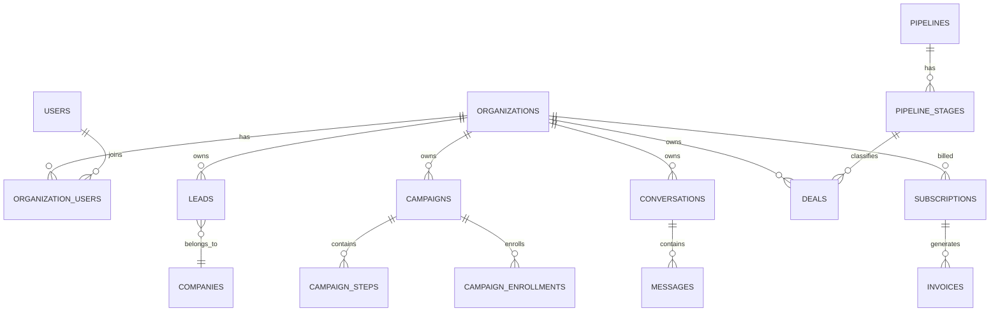

# LeadConnect Enterprise SaaS Blueprint

## 1. Product Requirements Document
LeadConnect is an organization-based multi-tenant SaaS platform that unifies LinkedIn prospecting, outreach automation, messaging, CRM pipeline, reporting, billing, and AI sales workflows.

Primary outcomes:
- Increase qualified meetings and revenue.
- Reduce manual outbound operations.
- Improve team visibility and forecasting.

## 2. User Stories
- As an Owner, I can create a workspace, invite users, and manage plans.
- As a Sales Rep, I can import and enrich leads, run campaigns, and manage deals.
- As a Manager, I can review performance dashboards and rep leaderboards.
- As Admin, I can manage roles, permissions, and integration settings.

## 3. Information Architecture
Main Sidebar:
- Dashboard
- Lead Generation
- Prospects
- Messaging
- Campaigns
- CRM
- Deals
- Tasks
- Reports
- Integrations
- Team
- Billing
- Settings

Onboarding:
1. Create account
2. Verify email
3. Create workspace
4. Invite team
5. Connect LinkedIn
6. Create campaign
7. Import prospects
8. Start outreach

## 4. Database Schema
Core tables (UUIDs + soft deletes where needed):
- organizations, users, organization_users
- roles, permissions, model_has_roles
- leads, tags, lead_tag, companies, lead_status_history
- campaigns, campaign_steps, campaign_enrollments, campaign_events
- conversations, messages, message_templates, canned_responses
- pipelines, pipeline_stages, deals, deal_activities, deal_notes
- tasks, task_reminders, task_recurrence
- plans, subscriptions, invoices, coupons, usage_records
- notifications, audit_logs, webhooks, webhook_deliveries
- ai_requests, ai_outputs, ai_usage_costs

## 5. ERD Diagram

## 6. API Specification
REST API versioned under `/api/v1`:
- Auth
- Organizations
- Users
- Leads
- Campaigns
- Messages
- Deals
- Tasks
- Reports
- Billing

Includes:
- OpenAPI/Swagger docs
- Sanctum API tokens
- Per-plan rate limits
- Webhook signing and retries

## 7. Laravel Module Structure
- app/Domain/Auth
- app/Domain/Organizations
- app/Domain/Leads
- app/Domain/Campaigns
- app/Domain/Messaging
- app/Domain/CRM
- app/Domain/Tasks
- app/Domain/Reports
- app/Domain/Billing
- app/Domain/AI
- app/Application
- app/Infrastructure

## 8. Backend Implementation
- Repository + service layer + DTOs.
- Domain events and queued listeners.
- Tenant middleware and global org scope.
- Auditing, policy-based RBAC, and activity tracking.

## 9. Frontend Implementation
- Inertia + Vue 3 + TypeScript + Pinia.
- Tailwind design tokens and enterprise SaaS layout.
- Kanban for deals, unified inbox, and campaign builder views.

## 10. Queue Architecture
Redis + Horizon with queue lanes:
- high: message and inbox events
- default: campaign execution
- low: exports and analytics backfills

## 11. WebSocket Architecture
Laravel Reverb channels scoped by organization:
- notifications
- inbox updates
- campaign status
- deal stage updates

## 12. Billing System
Plans: Starter, Professional, Growth, Enterprise.
Features: monthly/annual billing, coupons, invoices, proration, usage, seat pricing.
Providers: Stripe + Paddle abstraction.

## 13. AI Integration Layer
Provider abstraction for OpenAI and Anthropic:
- lead scoring
- message/email generation
- reply suggestions
- campaign generation
- meeting summary
- next best action

## 14. Docker Setup
Containers:
- app-php
- nginx
- mysql
- redis
- meilisearch
- horizon worker
- queue worker
- reverb
- scheduler

## 15. CI/CD Pipeline
GitHub Actions pipeline:
- lint and static analysis
- unit/feature tests
- frontend type checks
- docker build
- staged deployment with approvals

## 16. Automated Tests
- Unit: services, policies, DTOs
- Feature: onboarding, campaigns, inbox, CRM
- Integration: webhooks, OAuth, search sync
- Tenant isolation tests mandatory

## 17. Deployment Guide
- Configure env and secrets.
- Run migrations safely.
- Warm cache/routes/config.
- Restart workers.
- Verify health checks and queue latency.

## 18. Production Checklist
- Security hardening (2FA, CSRF, session controls)
- Monitoring and alerting
- Backup and restore drills
- Rate limit and abuse controls
- Billing and entitlement validation
- Audit and compliance readiness
